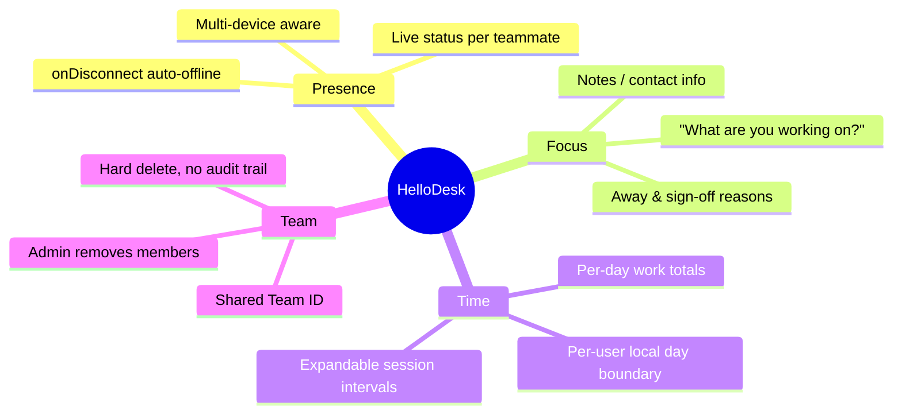
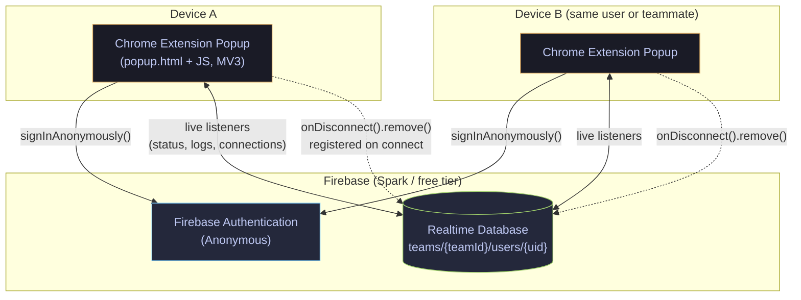
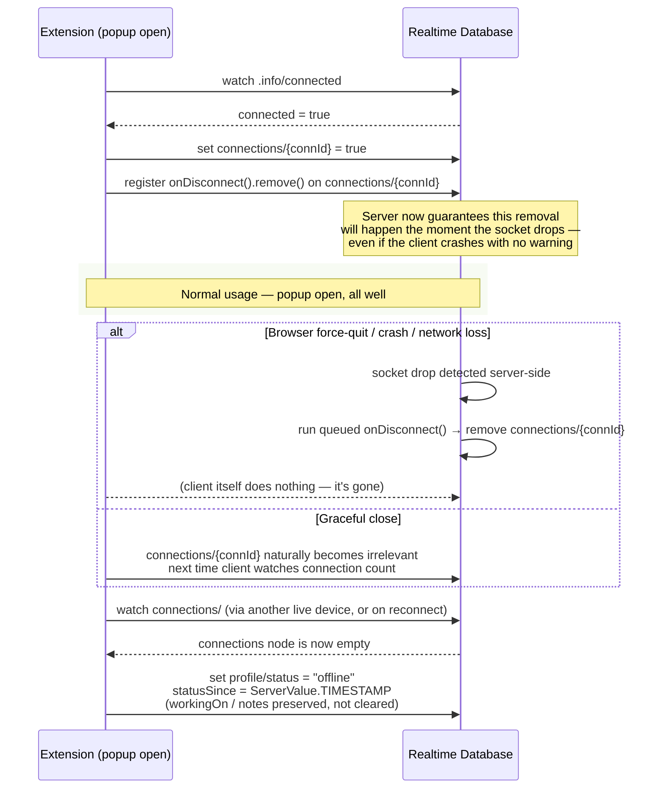
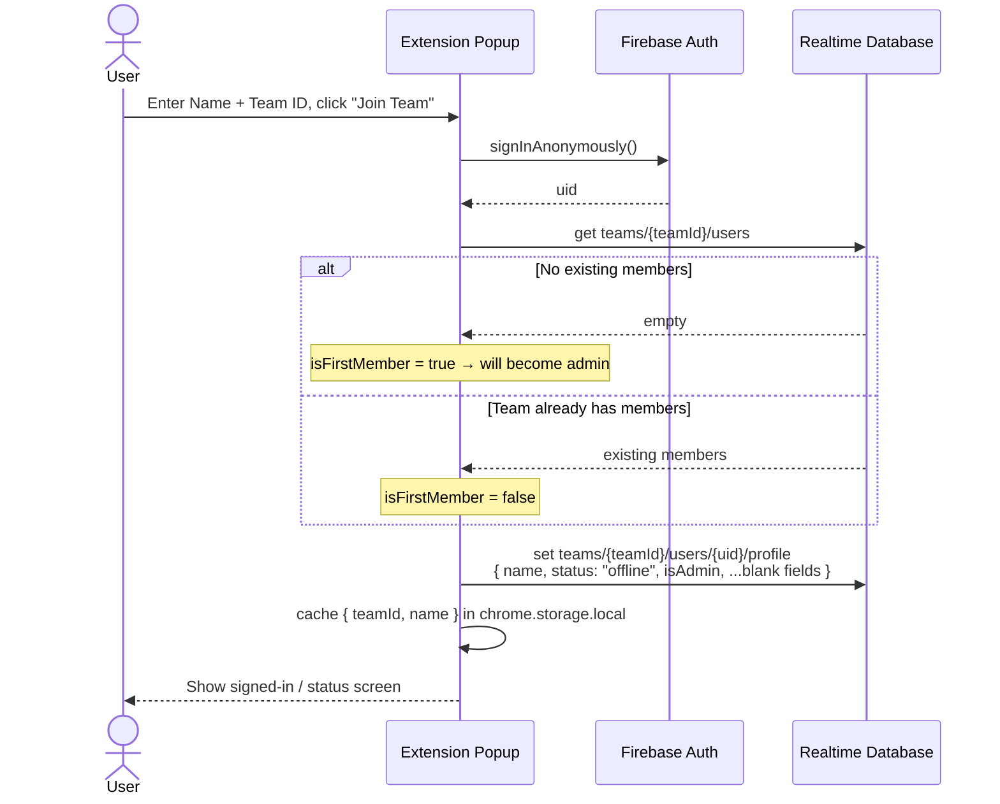
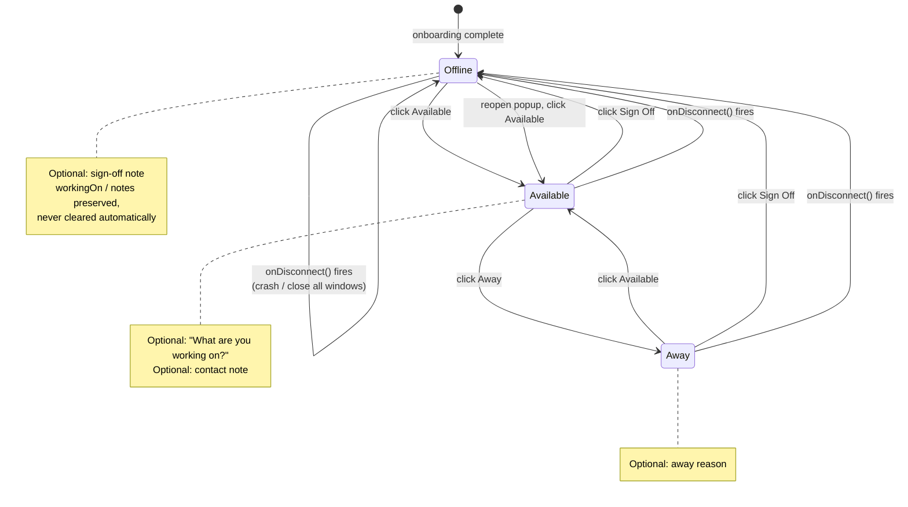
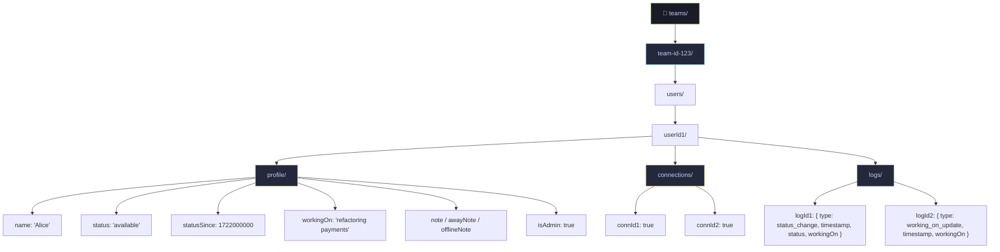
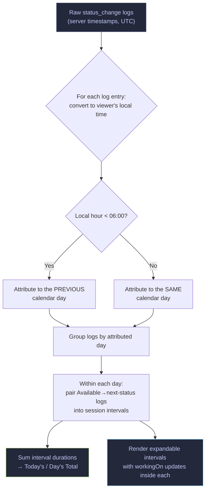
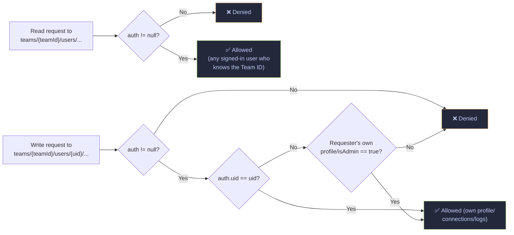

<div align="center">

# ⚡ HelloDesk

**A lightweight, real-time availability tracker for remote dev teams.**

Who's online. What they're working on. How many hours they've logged today.
No pings, no standups, no invasive monitoring.

`Chrome Extension (MV3)` · `Firebase Realtime Database` · `Anonymous Auth` · `Zero servers to maintain`

</div>

---

```
$ HelloDesk
* * *

My Status
[Available] [Away] [Sign Off]

Working on:
┌────────────────────────────┐
│ UI upgrade on PR #76        │
└────────────────────────────┘

* * *
Team

[A] Alice        since 09:30
   "refactoring payments"
[W] Bob          since 14:00
   "short break, back 20m"
[O] You          since 23:45
   "signing off, back tom."
```

---

## Table of Contents

- [What is this](#what-is-this)
- [Features](#features)
- [Architecture](#architecture)
- [How presence detection works](#how-presence-detection-works)
- [Onboarding flow](#onboarding-flow)
- [Status lifecycle](#status-lifecycle)
- [Data model](#data-model)
- [History & day-boundary logic](#history--day-boundary-logic)
- [Security model](#security-model)
- [Tech stack](#tech-stack)
- [Project structure](#project-structure)
- [Design system](#design-system)
- [Build status](#build-status)
- [Known limitations](#known-limitations)
- [Roadmap](#roadmap)
- [Getting started](#getting-started)
- [Contributing](#contributing)

---

## What is this

HelloDesk answers three questions at a glance, for teams that work
asynchronously across time zones:

1. **Who's online and available right now?**
2. **What are they currently working on?**
3. **How many hours have they worked today (and on previous days)?**

It replaces the informal "who's around?" ping-pong and manual time tracking
with a one-click popup — no dashboards to check, no separate app to run, no
backend to deploy or pay for.



---

## Features

| | Feature | Notes |
|---|---|---|
| 🟢 | **Live status** | Available / Away / Sign Off, color-coded, updates in real time while the popup is open |
| 📝 | **"What are you working on?"** | Free-text field visible to the whole team |
| 💬 | **Contextual notes** | Away reasons, sign-off notes, contact hints |
| 🖥️ | **Multi-device presence** | Online as long as *any* device has an active connection |
| 🔌 | **Crash-safe offline detection** | `onDisconnect()` fires even on a force-quit browser |
| 🕒 | **Daily work totals** | Auto-computed from timestamped status logs |
| 📅 | **Full history view** | Browse any past day, see session intervals and what you worked on |
| 🌍 | **Per-user day boundaries** | A 2am session in Manila doesn't corrupt a colleague's day in Lisbon |
| 👤 | **Anonymous auth** | No email, no password, no personal data required to join |
| 🛠️ | **Admin controls** | First joiner becomes admin, can remove teammates |
| 🎨 | **Terminal aesthetic** | Monospaced, dark, ASCII dividers — built for people who live in a terminal |
| ☁️ | **Zero server maintenance** | Runs entirely on Firebase's free Spark tier — no Cloud Functions, no billing plan |

---

## Architecture

HelloDesk is deliberately thin: a Chrome popup talking straight to Firebase.
There is no backend server, no API layer, and (per a locked v1 decision) no
Cloud Functions.



**Key architectural choices:**

- **No Cloud Functions.** Presence is handled entirely client-side via
  Firebase's `onDisconnect()` primitive — the one mechanism designed to
  survive a hard browser crash without server-side code.
- **Listeners live in the popup only.** The popup's script context is the
  only place holding live Firebase listeners. When the popup closes, those
  listeners die — background "someone just came online" notifications are
  an intentionally deferred feature, not an oversight.
- **Multi-device via a connection counter**, not a single online flag —
  a user with a laptop *and* a desktop open stays "online" until the *last*
  connection drops.

---

## How presence detection works

This is the part of the system doing the most work with the least code.



The guarantee that makes this safe: `onDisconnect()` is registered **on the
server**, not the client. Even if the extension is killed instantly with no
chance to run any JS, Firebase's own server notices the dropped socket and
fires the cleanup anyway.

---

## Onboarding flow



On every later popup open, the cached `teamId` skips the form entirely and
Firebase Auth's persisted anonymous session (stored in the extension's own
IndexedDB) reattaches without asking the user to sign in again.

---

## Status lifecycle



Every transition is timestamped with `ServerValue.TIMESTAMP` (never the
client's clock) and appended to that user's `logs/` — this timestamped log
is the entire source of truth the History view later reconstructs totals
and session intervals from.

---

## Data model

Everything lives under a single Realtime Database tree, scoped per team:



- **`profile`** — the current, mutable snapshot the Team view reads.
- **`connections`** — a live counter keyed by connection ID; presence is
  "at least one key exists here."
- **`logs`** — an append-only, timestamped audit trail that the History view
  replays to compute totals and session intervals. Kept indefinitely in v1.

---

## History & day-boundary logic

The trickiest correctness problem in the whole app: a cross-timezone team
means a single global "midnight" would misattribute sessions for anyone not
in one specific timezone.



Default day boundary: **06:00 local time.** A session running 22:00 → 02:00
counts entirely toward the day it *started* on, so a late-night refactor
doesn't get split across two days' totals.

---

## Security model



The **Team ID itself is a shared secret, not real access control** —
security-by-obscurity until an invitation system exists (see
[Roadmap](#roadmap)). Anyone holding the string can join and read that
team's data; rules gate *who's authenticated*, not who's allowed to have
learned the Team ID in the first place.

Reads are intentionally **not** gated behind "already a listed member" — an
earlier draft of these rules required exactly that
(`data.child(auth.uid).exists()`), which turned out to be a chicken-and-egg
deadlock: it blocked every first-time joiner, including a team's very first
member, since nobody has a listing yet before they've joined. The read side
was relaxed to "any authenticated user" instead, which is consistent with
the security-by-obscurity model above rather than a weakening of it. Writes
still require you to own the node (or hold `isAdmin`, for removing another
member — see [Manage Team](#status-lifecycle)).

`firebase.rules.json` in this repo is the actual published, working
ruleset — test any change in the Firebase Rules Playground/simulator before
trusting it with real data (see [SETUP.md](SETUP.md)).

---

## Tech stack

| Layer | Choice | Why |
|---|---|---|
| Extension shell | **Manifest V3**, plain HTML/CSS/JS | No build step, no bundler — just files Chrome loads directly |
| Backend | **Firebase Realtime Database** | Free tier, live sync out of the box, `onDisconnect()` primitive |
| Auth | **Firebase Anonymous Auth** | No email/password friction, no personal data collected |
| SDK delivery | **Vendored ESM bundles** (`lib/firebase/`) | MV3's default CSP (`script-src 'self'`) blocks loading scripts from a remote CDN, so the Firebase SDK is downloaded once and self-hosted inside the extension |
| Fonts | JetBrains Mono / Fira Code / Ubuntu Mono | Monospaced, open-licensed, terminal-native feel |
| Hosting | *None* | The extension itself is the only "deployment" — no servers to run or pay for |

---

## Project structure

```
hellodesk/
├── manifest.json
├── popup.html
├── css/
│   └── popup.css              # dark terminal theme, all views
├── js/
│   ├── firebase-config.js     # gitignored — your own Firebase project keys
│   ├── firebase-init.js       # initializes app/auth/db from vendored SDK
│   ├── onboarding.js          # Name + Team ID → anonymous sign-in → profile
│   ├── status.js              # Available / Away / Sign Off + text fields
│   ├── presence.js            # connection counter + onDisconnect()
│   ├── team-view.js           # live-listener team list
│   ├── history.js             # per-day totals + session intervals
│   ├── day-utils.js           # per-user local day-boundary math
│   ├── manage-team.js         # admin panel: view/remove members
│   └── popup.js                # orchestrates all of the above
├── lib/
│   └── firebase/               # vendored Firebase SDK (self-hosted, see Security note above)
└── icons/
    ├── icon16.png / icon48.png / icon128.png
```

---

## Design system

Terminal-inspired, dark by default, monospaced throughout.

| Role | Swatch | Hex |
|---|---|---|
| Background | ⬛ | `#1a1b26` |
| Card / Surface | 🟪 | `#24283b` |
| Primary text | ⬜ | `#c0caf5` |
| Secondary text (timestamps) | ◻️ | `#9aa5ce` |
| Accent — Available | 🟩 | `#9ece6a` |
| Accent — Away | 🟧 | `#e0af68` |
| Accent — Offline | ⬜ | `#565f89` |
| Highlight / Links | 🟦 | `#7dcfff` |
| Separators (`* * *`) | ▫️ | `#3b4261` |

Status indicators are `[A]` / `[W]` / `[O]` colored text, not graphical
icons — consistent with the "typography *is* the brand" philosophy (no logo
image is used anywhere in the extension by design).

---

## Build status

All nine planned v1 milestones are complete:


Full requirements, rationale for every locked decision, and detailed
per-milestone notes live in [SRS.md](SRS.md).

---

## Known limitations

Deliberately shipped as-is for v1 — tracked, not hidden:

- **Admin-assignment race** — "first user becomes admin" is a
  read-then-write, not an atomic transaction. Two people joining a
  brand-new team in the same instant could theoretically both become admin.
  Low risk at target team size (2–50).
- **No re-onboard fallback** — if a cached session exists but the persisted
  Firebase Auth session never resolves, the popup can stay on "Loading..."
  with no automatic path back to the onboarding form.
- **Day-boundary uses the viewing browser's local time**, not a stored
  per-user timezone (none exists in the data model) — an approximation of
  "per-user local time," not a literal one.
- **History data grows unbounded** — kept indefinitely in v1; fine for
  target team size near-term, export/pruning is a future consideration.
- **No error/retry UI on real-time listeners** — if the live Firebase
  connection drops and doesn't recover, the last-rendered view just stays
  stuck with no visible error or reconnect affordance.
- **Presence drops on popup close, not just browser close** — there's no
  background worker in v1 (by design), so closing the popup ends the same
  connection that tracks presence. Expected, not a bug: you re-click
  Available on reopen.

---

## Roadmap

Explicitly **not** built in v1 — noted here so scope stays honest, not as a
promise:

- 🖥️ **Web dashboard** — read-only status board for office TVs
- 🎟️ **Invitation system** — single-use invite codes instead of a shared
  Team ID string
- 🔗 **GitHub integration** — auto-update "working on" from open PR/branch
  names
- 💬 **Slack / Discord bots** — daily summaries posted to team channels
- 📱 **Mobile companion (PWA)** — quick availability toggles from a phone
- 📊 **Advanced analytics** — team-level trends, heatmaps, exportable
  reports
- 🔔 **Background notifications** — passive "just came online" browser
  toasts, via `chrome.alarms` polling, if real usage ever shows people
  need it
- 🗄️ **Archive-instead-of-delete** on member removal, plus history
  export/pruning for long-lived teams

---

## Getting started

Full step-by-step setup — creating your own Firebase project, wiring in
your config, loading the unpacked extension — lives in
**[SETUP.md](SETUP.md)**. It's written to get you from a fresh clone to a
working extension using your own (free) Firebase project, with nobody's
real credentials committed to this repo.

---

## Contributing

- [SRS.md](SRS.md) is the source of truth for requirements and design
  decisions — read **§0 (Locked Decisions)** before proposing anything that
  touches architecture.
- This is a small, single-purpose tool by design (§1.2) — please don't
  scope-creep into the [Roadmap](#roadmap) items above unless that's
  specifically what you're picking up.
- Keep PRs targeted; avoid drive-by refactors bundled with feature changes.